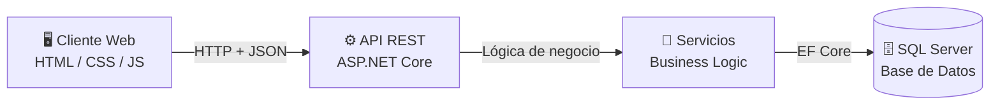
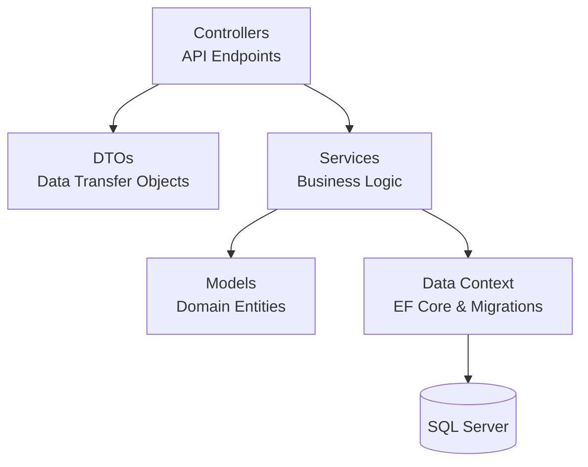
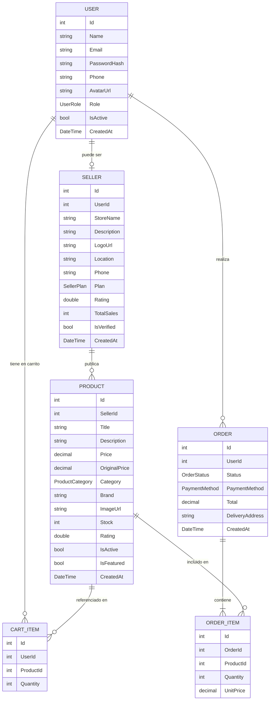

# 🛒 Zonama

> **El marketplace que conecta a El Salvador.**
> Plataforma de comercio electrónico diseñada para empoderar a vendedores locales y conectarlos con compradores en todo el país.

---

## 📋 Descripción General

Zonama es una plataforma marketplace de comercio electrónico orientada al mercado salvadoreño. Su propósito es resolver una necesidad real: miles de emprendedores, artesanos y pequeños negocios en El Salvador no cuentan con una plataforma digital accesible, local y en español para vender sus productos.

Las opciones existentes son internacionales, costosas o no están adaptadas a la realidad del mercado salvadoreño. **Zonama nace para cambiar eso.**

La plataforma permite que cualquier persona pueda:
- Registrarse como comprador y explorar un catálogo de productos locales.
- Crear su propia tienda en línea en minutos y comenzar a vender.
- Gestionar sus productos, inventario y órdenes desde un panel centralizado.

Zonama no es solo una tienda en línea — es una herramienta de desarrollo económico para El Salvador, construida con una arquitectura escalable preparada para crecer junto al comercio digital del país.

---

## ✨ Características

### Para compradores
- 🔐 Registro e inicio de sesión seguro con JWT
- 🔍 Exploración y búsqueda de productos con filtros avanzados
- 🛒 Carrito de compras sincronizado con la base de datos
- 📦 Gestión de órdenes y seguimiento de estado
- ❤️ Lista de favoritos (wishlist)
- 👤 Perfil editable con foto de usuario

### Para vendedores
- 🏪 Creación de tienda en línea propia
- 📦 Alta, edición y eliminación de productos
- 🖼️ Subida de imágenes de productos (archivo o URL)
- 📊 Dashboard con estadísticas: ingresos, productos activos, órdenes pendientes
- 🔄 Gestión de estados de órdenes (Pending → Confirmed → Shipped → Delivered)
- 🏆 Planes de vendedor: Basic, Pro, Premium

### Del sistema
- 🔒 Autenticación y autorización por roles (Buyer, Seller, Admin)
- 🌐 API REST documentada con Swagger / OpenAPI
- 🗃️ Base de datos relacional con migraciones automáticas
- 📁 Almacenamiento de imágenes en servidor
- 🔄 Renovación automática de token JWT al cambiar de rol
- 🏷️ Categorías de productos: Electronics, Clothing, Books, Sports, Home, Beauty, Toys, Automotive, Other

---

## 🏗️ Arquitectura del Sistema

Zonama adopta un modelo por capas desacoplado que garantiza separación de responsabilidades, facilitando el escalamiento, mantenimiento y testing.



### Capas del backend



| Capa | Responsabilidad |
|---|---|
| **Controllers** | Reciben las peticiones HTTP y las dirigen al servicio correspondiente |
| **DTOs** | Definen la forma exacta de los datos que entran y salen del API |
| **Services** | Contienen toda la lógica de negocio, aislada de los controladores |
| **Models** | Representan las entidades del dominio y su mapeo a la base de datos |
| **Data Context** | Puente entre el código C# y SQL Server, gestiona migraciones |

---

## 🛠️ Tecnologías Utilizadas

| Área | Tecnología | Versión |
|---|---|---|
| **Frontend** | HTML5, CSS3, JavaScript (Vanilla) | — |
| **Backend** | ASP.NET Core (C#) | .NET 10 |
| **Base de Datos** | SQL Server / LocalDB | 2022 |
| **ORM** | Entity Framework Core | 9.0 |
| **Autenticación** | JWT Bearer Tokens | — |
| **Encriptación** | BCrypt.Net | 4.0 |
| **Documentación** | Swagger / OpenAPI | 6.9 |
| **Control de versiones** | Git / GitHub | — |
| **Mapas** | Leaflet.js | 1.9.4 |

---

## 📁 Estructura del Proyecto

```
New-Zonama-Plus/
│
├── 📄 index.html                  # Página principal
├── 📄 products.html               # Catálogo completo de productos
├── 📄 seller.html                 # Página de vendedores y planes
│
├── 📁 css/
│   ├── styles.css                 # Estilos globales
│   └── animations.css             # Animaciones y transiciones
│
├── 📁 Js/
│   └── script.js                  # Lógica del frontend + conexión al API
│
├── 📁 data/
│   ├── logo/                      # Logotipos
│   └── productos/                 # Imágenes de productos
│
└── 📁 ZonamaAPI/                  # Backend ASP.NET Core
    │
    ├── 📁 Controllers/
    │   ├── UsersController.cs
    │   ├── SellersController.cs
    │   ├── ProductsController.cs
    │   ├── CartController.cs
    │   ├── OrdersController.cs
    │   └── UploadsController.cs
    │
    ├── 📁 Services/
    │   ├── UserService.cs
    │   ├── SellerService.cs
    │   ├── ProductService.cs
    │   ├── CartService.cs
    │   ├── OrderService.cs
    │   └── 📁 Interfaces/
    │       ├── IUserService.cs
    │       ├── ISellerService.cs
    │       ├── IProductService.cs
    │       ├── ICartService.cs
    │       └── IOrderService.cs
    │
    ├── 📁 Models/
    │   ├── User.cs
    │   ├── Seller.cs
    │   ├── Product.cs
    │   ├── Cart.cs
    │   ├── Order.cs
    │   └── Enums.cs
    │
    ├── 📁 DTOs/
    │   ├── UserDtos.cs
    │   ├── SellerDtos.cs
    │   ├── ProductDtos.cs
    │   ├── CartDtos.cs
    │   └── OrderDtos.cs
    │
    ├── 📁 Data/
    │   ├── ZonamaDbContext.cs
    │   └── DbSeeder.cs
    │
    ├── 📁 Common/
    │   └── ApiResponse.cs
    │
    ├── 📁 Migrations/
    ├── 📄 Program.cs
    └── 📄 appsettings.json
```

---

## 🗃️ Modelo de Datos



### Entidades principales

| Entidad | Descripción |
|---|---|
| **User** | Persona registrada. Puede ser Buyer, Seller o Admin |
| **Seller** | Perfil de tienda vinculado a un User con rol Seller |
| **Product** | Artículo publicado por un Seller, pertenece a una categoría |
| **Cart** | Items temporales que el comprador ha seleccionado |
| **Order** | Compra confirmada con estado rastreable |
| **OrderItem** | Línea de detalle de una orden (producto + cantidad + precio) |

### Roles del sistema

| Rol | Descripción |
|---|---|
| `Buyer` | Usuario registrado que puede comprar |
| `Seller` | Usuario con tienda activa que puede publicar productos |
| `Admin` | Acceso total al sistema |

---

## 🌐 API REST

Base URL: `http://localhost:5000`

Documentación interactiva: `http://localhost:5000/swagger`

### Autenticación

Los endpoints protegidos requieren el header:
```
Authorization: Bearer <token>
```

---

### 👤 Usuarios — `/api/users`

#### `POST /api/users/register`
Registrar un nuevo usuario.

**Request:**
```json
{
  "name": "Juan Pérez",
  "email": "juan@correo.com",
  "password": "123456",
  "phone": "555-1234"
}
```

**Response `200 OK`:**
```json
{
  "success": true,
  "data": {
    "token": "eyJhbGciOiJIUzI1NiIsInR5cCI6IkpXVCJ9...",
    "user": {
      "id": 1,
      "name": "Juan Pérez",
      "email": "juan@correo.com",
      "role": "Buyer",
      "createdAt": "2025-06-01T10:00:00"
    }
  }
}
```

---

#### `POST /api/users/login`
Iniciar sesión.

**Request:**
```json
{
  "email": "juan@correo.com",
  "password": "123456"
}
```

**Response `200 OK`:**
```json
{
  "success": true,
  "data": {
    "token": "eyJhbGciOiJIUzI1NiIsInR5cCI6IkpXVCJ9...",
    "user": {
      "id": 1,
      "name": "Juan Pérez",
      "role": "Seller"
    }
  }
}
```

---

#### `GET /api/users/me` 🔐
Ver mi perfil.

**Response `200 OK`:**
```json
{
  "success": true,
  "data": {
    "id": 1,
    "name": "Juan Pérez",
    "email": "juan@correo.com",
    "phone": "555-1234",
    "avatarUrl": null,
    "role": "Seller",
    "createdAt": "2025-06-01T10:00:00"
  }
}
```

---

### 🏪 Vendedores — `/api/sellers`

#### `POST /api/sellers/register` 🔐
Registrar una tienda. Cambia el rol del usuario a Seller.

**Request:**
```json
{
  "storeName": "TechZone SV",
  "description": "Electrónicos y gadgets al mejor precio",
  "location": "San Salvador",
  "phone": "555-0001",
  "plan": "Pro"
}
```

**Response `200 OK`:**
```json
{
  "success": true,
  "message": "Tienda registrada exitosamente.",
  "data": {
    "id": 1,
    "storeName": "TechZone SV",
    "plan": "Pro",
    "isVerified": false,
    "createdAt": "2025-06-01T10:05:00"
  }
}
```

---

#### `GET /api/sellers/{id}`
Ver una tienda por ID (público).

**Response `200 OK`:**
```json
{
  "success": true,
  "data": {
    "id": 1,
    "storeName": "TechZone SV",
    "description": "Electrónicos y gadgets al mejor precio",
    "location": "San Salvador",
    "rating": 4.8,
    "totalSales": 120,
    "isVerified": true
  }
}
```

---

#### `GET /api/sellers/dashboard` 🔐 Seller
Ver estadísticas de mi tienda.

**Response `200 OK`:**
```json
{
  "success": true,
  "data": {
    "totalProducts": 15,
    "activeProducts": 14,
    "totalRevenue": 2450.00,
    "pendingOrders": 3,
    "recentProducts": [...]
  }
}
```

---

### 📦 Productos — `/api/products`

#### `GET /api/products`
Listar todos los productos (público). Soporta filtros:

| Parámetro | Tipo | Descripción |
|---|---|---|
| `search` | string | Buscar por nombre o marca |
| `category` | string | Electronics, Clothing, Books... |
| `minPrice` | decimal | Precio mínimo |
| `maxPrice` | decimal | Precio máximo |
| `sellerId` | int | Filtrar por tienda |
| `isFeatured` | bool | Solo destacados |
| `sortBy` | string | newest, price_asc, price_desc, rating |
| `page` | int | Página (default: 1) |
| `pageSize` | int | Items por página (default: 20) |

**Response `200 OK`:**
```json
{
  "success": true,
  "data": {
    "items": [
      {
        "id": 1,
        "title": "Laptop Gamer Asus ROG",
        "price": 18999.99,
        "originalPrice": 21000.00,
        "category": "Electronics",
        "brand": "Asus",
        "imageUrl": "http://localhost:5000/uploads/abc123.jpg",
        "stock": 10,
        "rating": 4.7,
        "sellerName": "TechZone SV"
      }
    ],
    "totalCount": 42,
    "page": 1,
    "pageSize": 20
  }
}
```

---

#### `POST /api/products` 🔐 Seller
Crear un producto.

**Request:**
```json
{
  "title": "Laptop Gamer Asus ROG",
  "description": "RTX 4060, 16GB RAM, 512GB SSD",
  "price": 18999.99,
  "originalPrice": 21000.00,
  "category": "Electronics",
  "brand": "Asus",
  "imageUrl": "https://ejemplo.com/imagen.jpg",
  "stock": 10
}
```

**Response `201 Created`:**
```json
{
  "success": true,
  "message": "Producto creado.",
  "data": {
    "id": 5,
    "title": "Laptop Gamer Asus ROG",
    "price": 18999.99,
    "stock": 10,
    "createdAt": "2025-06-01T11:00:00"
  }
}
```

---

### 🛒 Carrito — `/api/cart` 🔐

| Método | Endpoint | Descripción |
|---|---|---|
| `GET` | `/api/cart` | Ver mi carrito |
| `POST` | `/api/cart` | Agregar producto |
| `PUT` | `/api/cart/{productId}` | Cambiar cantidad |
| `DELETE` | `/api/cart/{productId}` | Quitar producto |
| `DELETE` | `/api/cart` | Vaciar carrito |

---

### 📋 Órdenes — `/api/orders` 🔐

#### `POST /api/orders`
Crear una orden (checkout).

**Request:**
```json
{
  "paymentMethod": "Cash",
  "deliveryAddress": "Calle Principal, San Salvador",
  "deliveryLat": 13.6929,
  "deliveryLng": -89.2182,
  "notes": "Llamar antes de entregar"
}
```

**Response `200 OK`:**
```json
{
  "success": true,
  "data": {
    "id": 12,
    "status": "Pending",
    "total": 18999.99,
    "paymentMethod": "Cash",
    "items": [
      {
        "productTitle": "Laptop Gamer Asus ROG",
        "quantity": 1,
        "unitPrice": 18999.99,
        "subtotal": 18999.99
      }
    ],
    "createdAt": "2025-06-01T12:00:00"
  }
}
```

---

### Mapa de permisos

| Endpoint | Sin cuenta | Buyer | Seller | Admin |
|---|:---:|:---:|:---:|:---:|
| Ver productos | ✅ | ✅ | ✅ | ✅ |
| Ver tienda por ID | ✅ | ✅ | ✅ | ✅ |
| Registro / Login | ✅ | ✅ | ✅ | ✅ |
| Mi perfil / carrito / órdenes | ❌ | ✅ | ✅ | ✅ |
| Crear tienda | ❌ | ✅ | ❌ | ✅ |
| Crear / editar productos | ❌ | ❌ | ✅ | ✅ |
| Dashboard vendedor | ❌ | ❌ | ✅ | ✅ |
| Cambiar estado de orden | ❌ | ❌ | ✅ | ✅ |

---

## ⚙️ Instalación

### Requisitos previos

- [.NET 10 SDK](https://dotnet.microsoft.com/download)
- SQL Server Express o LocalDB (Windows)
- Visual Studio Code con extensión Live Server

### 1. Clonar el repositorio

```bash
git clone https://github.com/Tech-Shadow52/New-Zonama-Plus.git
cd New-Zonama-Plus
```

### 2. Configurar la base de datos

Editar `ZonamaAPI/appsettings.json`:

```json
{
  "ConnectionStrings": {
    "DefaultConnection": "Server=(localdb)\\mssqllocaldb;Database=ZonamaDB;Trusted_Connection=True;"
  }
}
```

### 3. Levantar el API

```bash
cd ZonamaAPI
dotnet run
```

> Las migraciones y el seed inicial se ejecutan automáticamente al arrancar.

El API queda disponible en:
```
http://localhost:5000
http://localhost:5000/swagger
```

### 4. Levantar el frontend

Abrir `index.html` con **Live Server** en VS Code.

```
http://127.0.0.1:5500
```

---

## 🔑 Variables de Entorno

Crear `ZonamaAPI/appsettings.json` basado en este ejemplo:

```json
{
  "ConnectionStrings": {
    "DefaultConnection": "Server=(localdb)\\mssqllocaldb;Database=ZonamaDB;Trusted_Connection=True;MultipleActiveResultSets=true"
  },
  "Jwt": {
    "Key": "CLAVE_SECRETA_MINIMO_32_CARACTERES_AQUI",
    "Issuer": "ZonamaAPI",
    "Audience": "ZonamaApp"
  },
  "AllowedHosts": "*",
  "Logging": {
    "LogLevel": {
      "Default": "Information",
      "Microsoft.AspNetCore": "Warning"
    }
  }
}
```

> ⚠️ **Nunca subas `appsettings.json` con claves reales a un repositorio público.**

---

## 🔒 Seguridad

| Práctica | Implementación |
|---|---|
| **Contraseñas** | Encriptadas con BCrypt — nunca se guardan en texto plano |
| **Autenticación** | JWT Bearer Tokens firmados con HMAC SHA-256 |
| **Expiración de tokens** | 7 días — renovables con `/api/users/refresh-token` |
| **Autorización por roles** | `[Authorize(Roles = "Seller,Admin")]` en cada endpoint |
| **Validación de datos** | DTOs con Data Annotations — rechazo de datos inválidos |
| **CORS** | Configurado solo para los orígenes permitidos |
| **Subida de archivos** | Extensiones permitidas: jpg, png, webp, avif, gif — máx. 5MB |
| **Soft delete** | Los productos no se eliminan físicamente (`IsActive = false`) |

---

## 🗺️ Roadmap

### Versión 1.1
- [ ] Sistema de reseñas y calificaciones de productos
- [ ] Notificaciones por email al crear una orden
- [ ] Panel de administrador completo

### Versión 1.2
- [ ] Integración con pasarela de pagos (Stripe / PayPal)
- [ ] Sistema de cupones y descuentos
- [ ] Búsqueda avanzada con Elasticsearch

### Versión 2.0
- [ ] Aplicación móvil (React Native)
- [ ] Sistema de logística y seguimiento de envíos en tiempo real
- [ ] Analítica de ventas para vendedores (charts, reportes exportables)
- [ ] Integración con Chivo Wallet (Bitcoin)
- [ ] Multi-idioma (español / inglés)

---

## 🤝 Contribución

1. Haz fork del repositorio
2. Crea una rama para tu feature:
```bash
git checkout -b feature/nueva-funcionalidad
```
3. Realiza tus cambios y commitea:
```bash
git commit -m "feat: agregar nueva funcionalidad"
```
4. Sube tu rama:
```bash
git push origin feature/nueva-funcionalidad
```
5. Abre un Pull Request describiendo los cambios

### Convención de commits

| Prefijo | Uso |
|---|---|
| `feat:` | Nueva funcionalidad |
| `fix:` | Corrección de bug |
| `docs:` | Cambios en documentación |
| `refactor:` | Refactorización de código |
| `style:` | Cambios de formato o estilo |

---

## 📄 Licencia

Este proyecto está bajo la licencia **MIT**. Consulta el archivo `LICENSE` para más detalles.

---

## 👨‍💻 Autor

**Tech Shadow** — [@Tech-Shadow52](https://github.com/Tech-Shadow52)

---

<div align="center">
  Hecho con orgullo en El Salvador 🇸🇻
</div>
